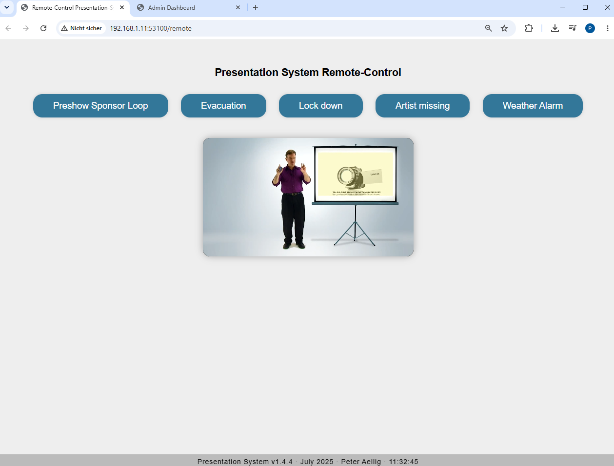
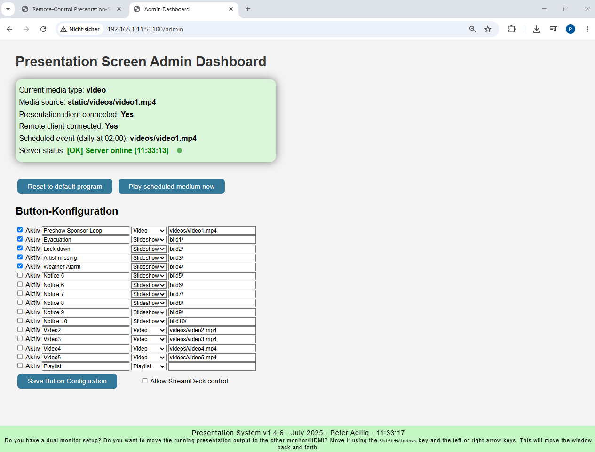
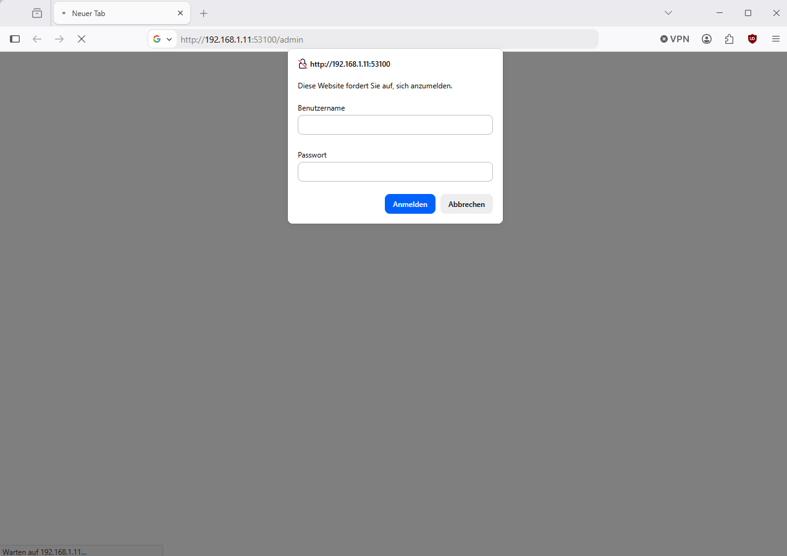

# Presentation Kiosk 1.4.7

A local alert and presentation system for temporary events, spontaneous
operations, and ad-hoc crisis management.

The system displays videos, images, slideshows, and playlists on a presentation
screen. Content can be controlled centrally through a simple web interface or,
optionally, an Elgato Stream Deck. Changes are distributed to all connected
clients in real time.

> The project is designed to be simple, self-explanatory, and location
> independent, requiring as little prior training as possible.

## Installation and startup

The complete installation guide is available in
[Installer/README.md](Installer/README.md).

Quick start:

1. Copy the project folder to `C:\kiosk`.
2. Run `Installer\Install_Kiosk.cmd` as administrator.
3. After installation, launch `C:\kiosk\kiosk.bat`.
4. Use the Firefox kiosk window that opens automatically.

The project explicitly uses **Python 3.12.6** and tested, pinned package
versions.

## Interfaces

### Presentation

The presentation interface runs in Firefox in full-screen kiosk mode. It
receives media changes through Socket.IO and displays individual images,
videos, slideshows, or playlists.


Local addresses:

- `http://localhost:53100/`
- `http://localhost:53100/presentation`
- `http://localhost:53100/presentation.html`

### Remote control

The browser-based Remote interface displays enabled media as clear control
buttons. Changes are applied immediately to the presentation. It also provides
previews for slideshows and videos.



Address:

```text
http://<KIOSK-IP>:53100/remote
```

Missing media is marked and cannot be started. Instead, the interface displays
a message containing the expected file or directory path.

### Admin dashboard

The Admin dashboard is used for technical monitoring and configuration. It
shows:

- the currently active medium;
- presentation and Remote connection status;
- the server heartbeat;
- the scheduled default medium;
- button assignments;
- Stream Deck lock status.



Address:

```text
http://<KIOSK-IP>:53100/admin
```

Missing media files and empty media directories are highlighted in the Admin
panel. When the configuration is saved, the previous `button_config.json` is
backed up automatically in `Backups`. The latest 20 backups are retained.

### Password protection

The Remote and Admin interfaces are protected by a username and password by
default. The credentials must be changed in `app.py` before production use.



## System architecture

The Kiosk system has a modular architecture:

```text
Remote / Admin / Stream Deck
             │
             ▼
      Flask + Socket.IO
           app.py
             │
             ▼
    Presentation browser
```

### Server — `app.py`

The Python server is the central component of the system:

- provides the Presentation, Remote, and Admin interfaces;
- manages the currently active medium;
- synchronizes clients in real time through Socket.IO;
- monitors connections using a heartbeat;
- starts a default medium at a configured time;
- verifies whether configured media is available;
- backs up changes to the button configuration.

The server listens on port `53100` by default.

### Presentation interface — `static/presentation.html`

- runs in the browser on the presentation computer;
- starts and stops images, videos, slideshows, and playlists;
- briefly displays the IP address and port during startup;
- reports the current presentation status to the server.

### Remote interface — `static/remote.html`

- loads enabled buttons dynamically from `button_config.json`;
- starts media through Socket.IO;
- displays previews and the current presentation status;
- blocks configured but missing media.

### Admin interface — `static/admin.html`

- displays server and client status;
- edits button assignments, labels, types, and media paths;
- highlights missing media;
- locks or unlocks Stream Deck input.

### Stream Deck driver — `app_streamdeck.py`

The separate Python process integrates a compatible Elgato Stream Deck:

- reads button assignments from `button_config.json`;
- renders labels and active states on the keys;
- sends local API commands to the server;
- reconnects automatically after server or USB interruptions;
- starts with input locked and initially acts as a status display.

## Communication

### Socket.IO

Socket.IO provides real-time communication between the server, Presentation,
Remote, Admin, and the Stream Deck driver. Important events include:

- `show_media` — change the active medium;
- `slideshow_image` — report the current slideshow image;
- `heartbeat_request` / `heartbeat_response` — check the connection;
- `reload_config` — reload button assignments;
- `set_streamdeck_input_lock` — lock or unlock Stream Deck input.

### Local HTTP API

The Stream Deck uses:

```text
http://localhost:53100/api?Function=<FUNCTION>
```

Example functions include `video1`, `bild3`, `playlist`, and `reset`.

For security, the API accepts requests only from the local Kiosk computer
(`127.0.0.1` or `::1`). External devices cannot call this API directly.

## Media and button assignments

All presentation media is stored below `static`:

| Path | Purpose |
|---|---|
| `static/videos` | individual videos |
| `static/videos_playlist` | continuous video playlist |
| `static/bild1` through `static/bild10` | images used for alerts and slideshows |
| `static/Message Templates` | templates for new alert graphics |

The `button_config.json` file defines:

- whether a button is enabled;
- its label;
- the media type (`video`, `slideshow`, or `playlist`);
- the associated file or directory path.

Media can be created on location and copied into the prepared directories. Only
the entries required for the current event need to be enabled in the Admin
panel.

## Scheduler

The server can automatically start a configured default medium at a specified
time each day. This can be used to return to a sponsor or advertising loop
after an event or alert message.

The `SCHEDULE_TIME` and `SCHEDULE_PROGRAM` settings are located in `app.py`.

## SDI output

If an SDI output is required, the HDMI signal from the presentation computer
can be connected to existing video infrastructure through an HDMI-to-SDI
converter.

Typical procedure on Windows 11:

1. Connect the presentation computer to the HDMI-to-SDI converter.
2. Select the relevant HDMI output in **Display settings**.
3. Set the resolution to, for example, `1920 × 1080`.
4. Open the adapter properties under **Advanced display**.
5. Use **List all modes** and select `1080i, 50 Hz` where available.

The available modes depend on the graphics card and driver. If only `1080p50`
is available, a suitable cross converter is required to produce a true
`1080i50` signal.

## Technologies

- Python 3.12.6
- Flask
- Flask-SocketIO
- Socket.IO
- Eventlet
- psutil
- Pillow
- StreamDeck SDK
- HIDAPI
- HTML, CSS, and JavaScript
- Mozilla Firefox in kiosk mode

The complete set of tested package versions is listed in
`Installer/requirements.txt`.

## Project structure

```text
C:\kiosk
├── app.py
├── app_streamdeck.py
├── button_config.json
├── kiosk.bat
├── Installer\
├── Manual\
├── static\
├── docs\images\
├── Backups\        # generated automatically
├── .venv\          # generated automatically
├── .vs\            # Visual Studio data only
└── __pycache__\    # generated Python cache
```

`.venv`, `.vs`, `__pycache__`, `Backups`, and temporary files are not required
in the Git repository.

## Security notes

- Change the default credentials before deployment.
- Use Remote and Admin only on a trusted production network.
- The Stream Deck API is available locally only.
- Stream Deck input remains locked until it is enabled in the Admin panel.

## Documentation

- [Installation manual](Installer/README.md)
- [Offline package preparation](Installer/Packages/README.txt)
- Additional Word and PDF documents are available in `Manual`.

## License

No separate license file is currently included with this project.

